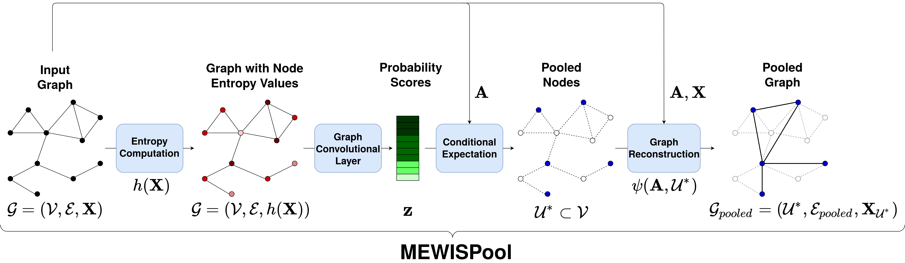

# Maximum Entroy Weighted Independent Set Pooling for Graph Neural Networks (MEWISPool)

In this paper, we propose a novel pooling layer for graph neural networks based
on maximizing the mutual information between the pooled graph and the input
graph. Since the maximum mutual information is difficult to compute, we em-
ploy the Shannon capacity of a graph as an inductive bias to our pooling method.
More precisely, we show that the input graph to the pooling layer can be viewed
as a representation of a noisy communication channel. For such a channel, send-
ing the symbols belonging to an independent set of the graph yields a reliable
and error-free transmission of information. We show that reaching the maximum
mutual information is equivalent to finding a maximum weight independent set of
the graph where the weights convey entropy contents. Through this communica-
tion theoretic standpoint, we provide a distinct perspective for posing the problem
of graph pooling as maximizing the information transmission rate across a noisy
communication channel, implemented by a graph neural network. We evaluate
our method, referred to as Maximum Entropy Weighted Independent Set Pooling
(MEWISPool), on graph classification tasks and the combinatorial optimization
problem of the maximum independent set. Empirical results demonstrate that our
method achieves the state-of-the-art and competitive results on graph classification
tasks and the maximum independent set problem in several benchmark datasets.

## Requirements
* Python >= 3.6.
* Pytorch=1.9.0.
* Torch Geometric=1.5.0

## Run
For running the graph classification code, initially clone the repository.
Give the execution permission to `run_graph_classification.sh`: `chmod +x run_graph_classification.sh`.
Finally, run `./run_graph_classification.sh`.
For the MIS task, follow the same procedure for the `run_mis.sh`. Note that the graph classification
experiment is conducted over the MUTAG dataset and the MIS task is solved over the Cora dataset. 

In case of failure in installation of the dependencies, please refer to [Pytorch Installation](https://pytorch.org/) and 
[Torch Geometric Installation](https://pytorch-geometric.readthedocs.io/en/latest/notes/installation.html).

